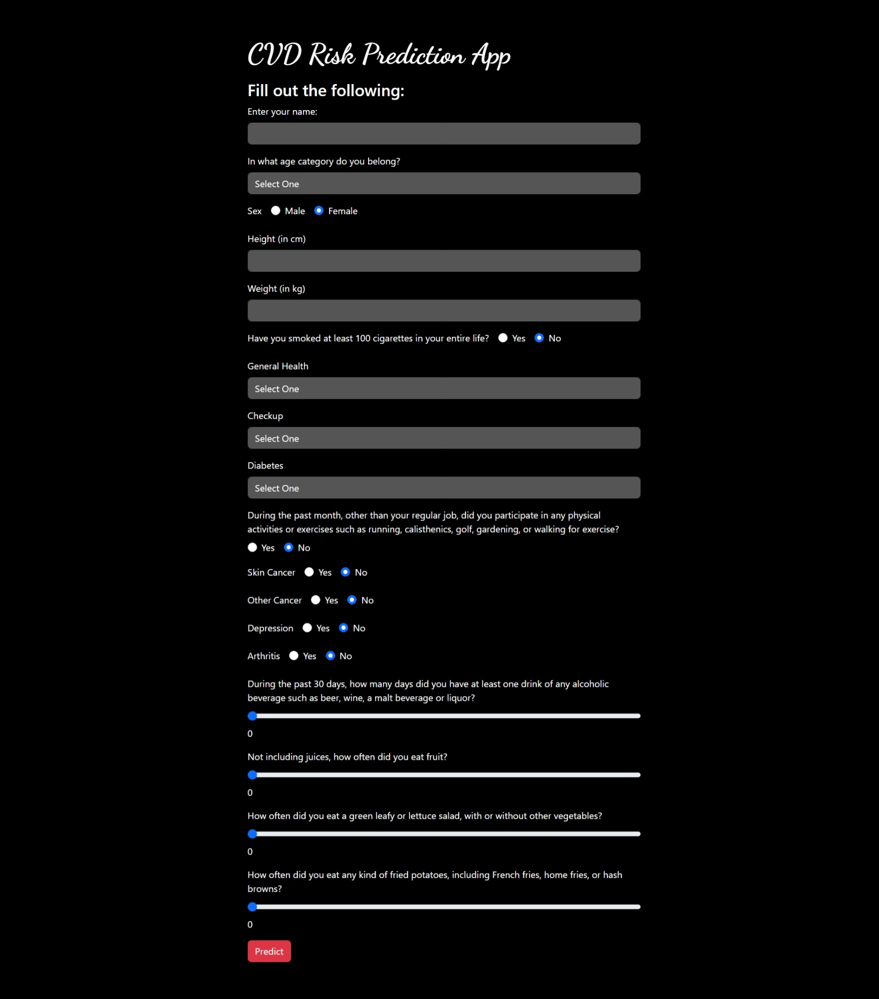

<h1 align="center">💥 CVD Risk Prediction Model 💥</h1>

<div align="center">
   <strong>An end-to-end Cardiovascular Disease (CVD) Risk Prediction model, built with Machine Learning, and deployed using Flask and Streamlit.</strong>
</div>

<br>

## 🚀 **Project Overview**

This project aims to predict **Cardiovascular Disease (CVD) Risk** based on a set of health-related features. It utilizes both Machine Learning and Deep Learning algorithms to provide accurate predictions, with a neural network model achieving an impressive accuracy of **91.92%**. The project includes a front-end web application built using Flask and deployed on **Streamlit** for broader accessibility.

---

## 🌟 **Key Highlights**

- **Exploratory Data Analysis (EDA):** Comprehensive analysis of features and their relationships to identify critical insights.
- **Model Development:** Implementation of various machine learning models, including a **Neural Network**, with performance tuning for optimized results.
- **Deployment:** End-to-end deployment using **Flask** and **Streamlit**, with a fully functional web interface for users to input their health data and receive predictions.
- **Real-time Predictions:** Users can input real-time health data and receive immediate predictions for their cardiovascular risk.

---

## 📊 **Features of the Project**

### 1. **Exploratory Data Analysis (EDA)**

- Conducted **univariate** and **bivariate** analysis to understand the distribution of features and their correlations with the target.
- Used **correlation heatmaps** to assess the relationships between different variables.

### 2. **Feature Engineering and Preprocessing**

- Reduced and selected the most important features based on correlation analysis and domain knowledge.
- Split the dataset into **training** and **testing** sets for model evaluation.

### 3. **Model Training and Performance**

- Trained multiple models, including **Neural Networks**, **Logistic Regression**, and **Decision Trees**.
- Achieved a **91.92% accuracy** with the Neural Network model, validated through metrics like **Mean Squared Error (MSE)** and **R² score**.
- Hyperparameter tuning was performed for further optimization.

### 4. **Web Application and Deployment**

- Integrated the model into a **Flask** web application with a clean, user-friendly interface.
- Deployed on **Streamlit** for cloud-based access, allowing users to input health data and get real-time risk predictions.

---

## ⚙️ **How to Use the Project**

### 1. Clone the Repository

```bash
git clone https://github.com/your-github-username/cardiovascular-disease-prediction-app.git
```

### 2. Set Up a Virtual Environment

```bash
python -m venv myenv
```

### 3. Activate the Virtual Environment

- **Windows:**

```bash
.\myenv\Scripts\activate
```

- **Linux/MacOS:**

```bash
source myenv/bin/activate
```

### 4. Install Required Libraries

Install all necessary libraries listed in `requirements.txt`:

```bash
pip install -r requirements.txt
```

### 5. Running the Flask Application

- To run the Flask-based app locally, use the command:

```bash
python flask_app.py
```

### 6. Running the Streamlit Application

- Run the Streamlit app using the following command:

```bash
streamlit run streamlit_app.py
```

> [Streamlit CVD Risk Prediction App](https://cvd-risk-prediction-app.streamlit.app/)

---

## 📈 **Exploratory Data Analysis**

### **Univariate Analysis**
Single feature analysis to visualize individual data distributions.


### **Bivariate Analysis**
Analyzing relationships between features and the target variable.


### **Correlation Analysis**
Explore relationships between variables to identify key contributors to cardiovascular risk.


---

## 🧠 **Model Performance and Deployment**

- **Model Accuracy:** The Neural Network model achieved **91.92% accuracy**, demonstrating its reliability in predicting cardiovascular disease risk.
- **Real-time Web Interface:** The web application, deployed using **Flask**, allows users to input their health parameters and instantly receive predictions on their cardiovascular risk.
- **Streamlit Deployment:** The application has also been deployed on Streamlit for easy, cloud-based access.

> [Streamlit CVD Risk Prediction App](https://cvd-risk-prediction-app.streamlit.app/)

### **Model Performance Metrics:**

- **Accuracy:** 91.92%


---

## 🛠 **Technologies Used**

- **Python:**  
  Libraries: `scikit-learn`, `TensorFlow`, `Pandas`, `Matplotlib`, `Seaborn`, `joblib`
- **Flask:**  
  Framework for creating the web app interface.
- **Streamlit:**  
  For cloud-based app deployment.
- **Jupyter Notebooks:**  
  For conducting Exploratory Data Analysis (EDA) and model development.

---

## 🎯 **Conclusion**

The **CVD Risk Prediction Model** demonstrates high accuracy and practical applicability. With its **91.92% accuracy**, it can serve as a valuable tool for health professionals and individuals alike. The streamlined front-end design, built using Flask and deployed on Streamlit, ensures ease of use for non-technical users to assess their cardiovascular risk based on health data.

---

## 📸 **Project Screenshots**

### **Power BI Dashboard**


### **Flask Application Screenshots**




### **Streamlit Application Screenshots**


---

<div align="center">
  <h3>Show some ❤️ by 🌟 starring this repository!</h3>
</div>

<a href="#top"></a>
